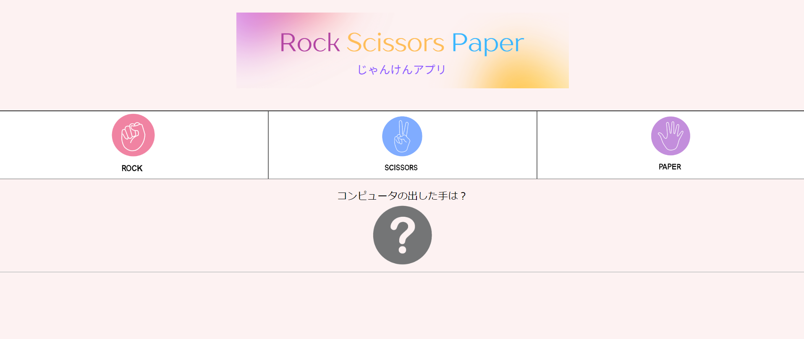
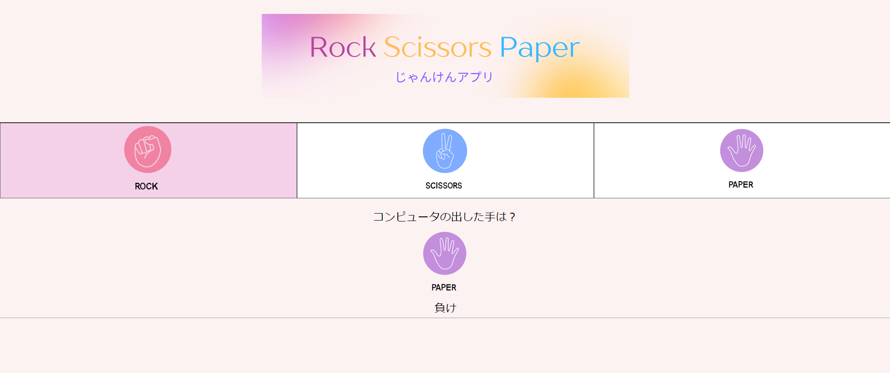
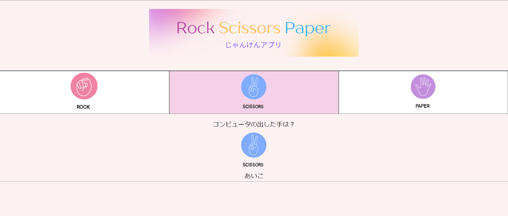
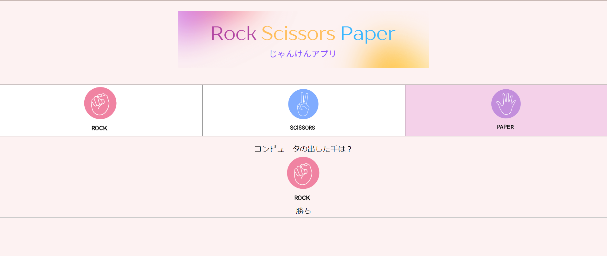

# ①課題番号-じゃんけんアプリ

## ②課題内容（どんな作品か）
-コンピュータとじゃんけんができるアプリです。

## ③DEMO
今回はなし

## ④工夫した点・こだわった点
-元々文字だったものを画像に置き換えた。 
-前回学んだCSSを使い少しデザインをしてみた。 
-コンピュータ側の手が「？」の画像からコンピュータが出した手に置き換わるようにした。

## ④難しかった点・次回トライしたいこと(又は機能)
- 全画面がノートPCの1画面に入り切るようにしたかったが、上手くCSSが機能せずできなかったため、入りきるようにしたい。 
- 勝ち負けの回数を表示できるようにしたい。   

## ⑤質問・疑問・感想、シェアしたいこと等なんでも
- [感想]おみくじアプリの演習を行ったことで思ったよりも簡単に完成しまったが、これだけだとJSは習得できていないと思うのでもう少し数をこなして色々な機能に慣れていきたい。

